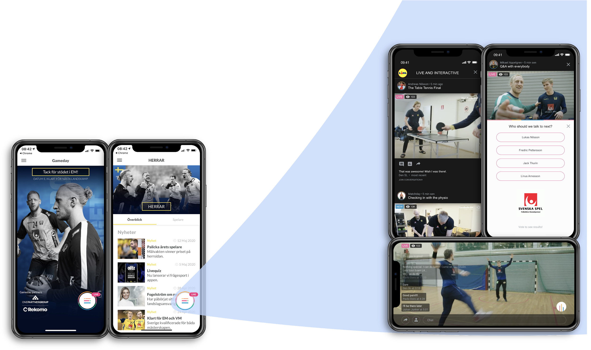
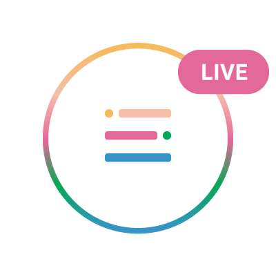
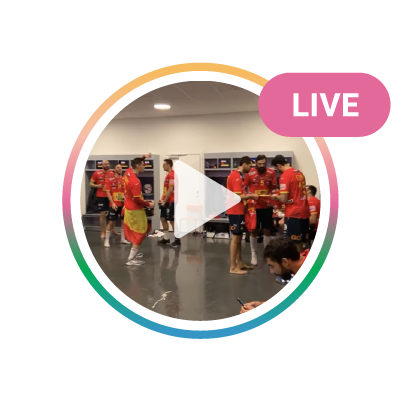
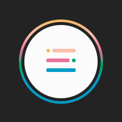
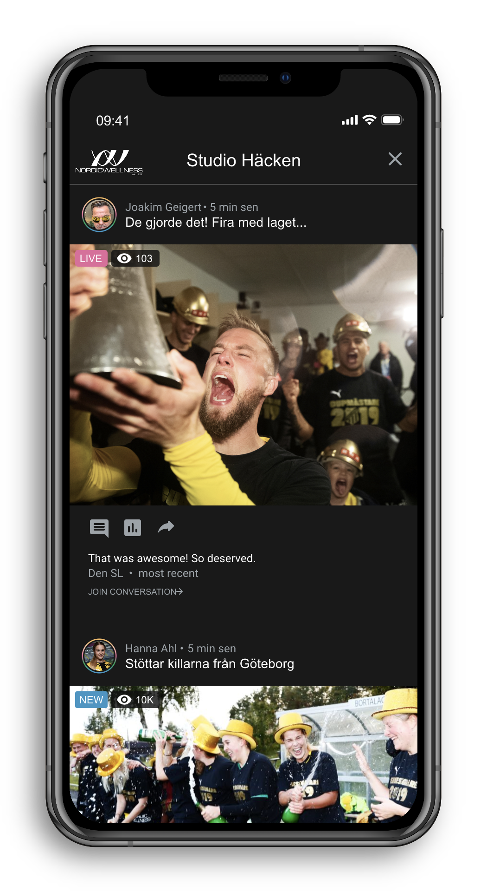
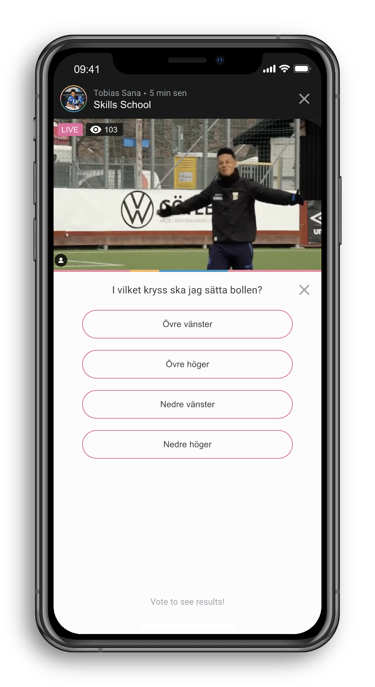
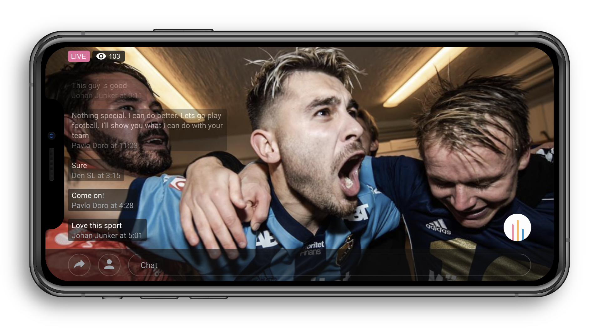
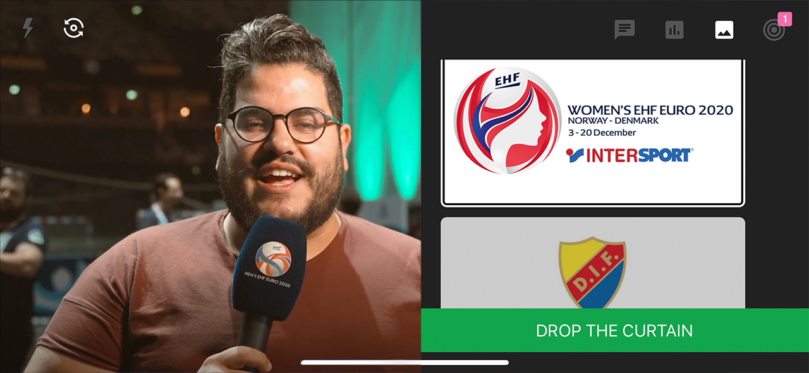

# Antourage Widget SDK

[](https://cocoapods.org/pods/Antourage)
[](https://cocoapods.org/pods/Antourage)
[](https://cocoapods.org/pods/Antourage)

## Antourage SDK Functional Description


The Antourage Widget is designed to work as a self-contained ‘widget’ within a host app. Once opened, the widget launches a micro-content vertical that includes live broadcasts and on-demand videos. This content is captured by our mobile Broadcaster application. Antourage is mobile first and designed for the creation and viewing of realtime and near real time micro-content.

<div style="display: flex; justify-content: center;">
  
</div>

### Magnetic Widget

The entry point for a user is the magnetic button that appears on the host app. Usually on the main screen, but flexible, the button can appear in more than one place. This magnetic widget can appear in multiple states.

#### "Resting"


If there are no live videos or new VOD’s to watch the widget will be in a “resting” state. When a user clicks the widget in its resting state, they are directed to the main menu of the widget.

#### "LIVE"

<div>



</div>

When a broadcaster starts streaming live video, the button changes state and animates. The live video can be seen inside the widget and “LIVE” tag appears. If a user taps the widget whilst in this state, they are taken directly to the live broadcast.

#### "NEW"



When there isn’t a live video, but there are unwatched VOD’s the widget animates with a “NEW” tag. If a user clicks the widget at this point, they will subsequently see the main menu.

### The Main Menu

The main menu allows the user to navigate through multiple live and new videos. Whilst navigating through the videos, if they stop scolling a video will play without sound.

If a user clicks on the comment or poll icon below any video they will be taken directly to the chat or poll within that video so that they can contribute immediately.

The main menu can also be customised, by editing the logo in the corner of the screen to surface the organisation or sponsors. The title of the menu can also be customised.



### Viewing Live Broadcasts

The video player may be used in portrait or landscape mode. In both modes, the viewer can watch the broadcast, see and contribute to comments, and see and respond to polls.

<div>
  
  
</div>

### Viewing On-demand videos

When the user taps on a video, the video begins playing at the beginning, or if this video has already been partially viewed, it will begin playing at the last point the viewer watched. The Antourage Widget keeps track of which videos the user has seen, and updates the number on the magnetic button accordingly.

Each video shows the name of the video, name of the broadcaster, total time, and total view count.

### Display Name

In order to contribute to the comments, a user must have an identity in our system, as well as a Display Name that shows in the comments stream. Since not all host apps require a username, we ask users to create a Display Name the first time they try to chat. If the host app does require users to create a username, we can turn off this feature.

### Comments

Comments are contributed by viewers of the live broadcast only. When a video is being watched later as VOD, these comments may be displayed, but cannot be added to. The broadcaster has the ability to review comments on a video and delete ones that they deem to be unacceptable. Antourage administration also has this ability.

### Polls

Polls are created by the broadcaster, and sent out during a live broadcast. They appear on the screen when they are first pushed out to the audience, and viewers can respond or simply close the poll if they do not want to answer. If they answer, they are shown the results right away, and they can see updated results as they come in.

These polls are sponsorable and images can be uploaded from the web application so that they surface on behalf of all broadcasters. This uploaded images can also be clickable and link to web pages for special offers or further sponsor activation.


### The Curtain

The curtain feature is supposed to mimic the purpose of a curtain at the theatre. To serve a business purpose such as sponsor exposure or ticket sales, a curtain be lowered at any time. Alternatively, a user can also use the curtain to hide what they are streaming whilst they prepare simulcasts or perform duties off camera.

Multiple curtains can be uploaded at the same time, therefore different messages/sponsors that you can be ready to raise awareness of when ready. 

<div style="display: flex; justify-content: center;">
  
</div>

### Curation

Content can only be created by those who have been actively been given access to stream by the administrator of our partner. Furthermore, with this access, broadcasters can only stream to the specific channels that they have been granted access to stream to. 


### Third Party Technology

To support our functionality, we use a few third-party services and applications.
Firebase: used for push notifications, comments and polls.
Amazon Media Live: used for streaming and hosting our content

## Example

To run the example project, clone the repo, and run `pod install` from the Example directory first.

## Requirements

iOS 11.3 +

## Installation

Antourage is available through [CocoaPods](https://cocoapods.org). To install
it, simply add the following line to your Podfile:
`pod 'Antourage'`.
And run `$ pod install`

## Usage

### Auth

It's static method (no need object init), you can use it anywhere you want (login/app start etc).

```swift
AntWidget.authWith(apiKey: "put_your_apiKey_there", refUserId: "put_user_id_from_your_base_or_nil", nickname: "put_user_nickname_from_your_base_or_nil") { result in
  switch result {
  case .success:
    break
  case .failure(let error):
    print(error)
  }
}
```
### Push notifications (Firebase approach)

To support PN on your side you should retrieve token for our senderID, send all needed data to us right after successful auth (you can call it in auth success block) and subscribe yourself to our topic.   

```swift
  //MARK: Connect PN to Antourage Firebase app
  Messaging.messaging().retrieveFCMToken(forSenderID: AntWidget.AntSenderId) { (token, error) in
    AntWidget.registerNotifications(FCMToken: token) { (result) in
      switch result {
       case .success(let topic):
         Messaging.messaging().subscribe(toTopic: topic)
       case .failure(let notificationError):
         print(notificationError.localizedDescription)
       }
    }
  }
```

To open directly Feed screen from PN interaction handler just get Feed controller and present it modally.
```swift
  func userNotificationCenter(_ center: UNUserNotificationCenter, didReceive response: UNNotificationResponse, withCompletionHandler completionHandler: @escaping () -> Void) {
    let userInfo = response.notification.request.content.userInfo
    print("\(userInfo)")
    if let category = userInfo["category"] as? String, category == "antourage" {
      guard let vc = UIApplication.shared.delegate?.window??.rootViewController else { reutrn }
      let antListController = AntWidget.shared.getListController()
       vc.present(antListController, animated: true, completion: nil)
    }
  }
```
### Add UI part

```swift
class ViewController: UIViewController {
  
  var widget: AntWidget! {
    didSet {
      view.addSubview(widget.view)
    }
  }
  override func viewDidLoad() {
    super.viewDidLoad()
    widget = AntWidget.shared
  } 
}
```


| Property          | Type     | Description                                                            |
|-------------------|----------|------------------------------------------------------------------------|
| onViewerAppear    | Closure | Called when the user opens the widget controller.                      |
| onViewerDisappear | Closure | Called when the user dismisses the widget controller.                  |
| widgetPosition | Enum | You can set any widget position from enum                  |
| widgetMargins | Struct | You can set custom horizontal and vertical margin for each position. But some positions may ignore it. Max vertical - 220, max horizontal - 50.                  |


## Author

Mykola Vaniurskyi, mv@leobit.com

## License

Antourage is available under the MIT license. See the LICENSE file for more info.
